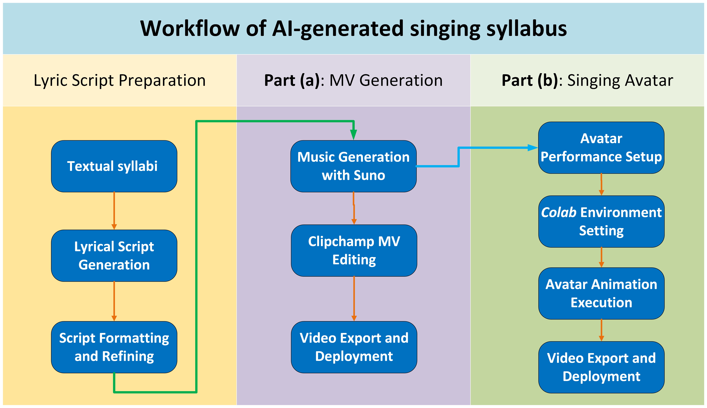

# Singing Syllabi with Virtual Avatars: Enhancing Student Engagement Through AI-Generated Music and Digital Embodiment

In practical teaching, we observe that few students thoroughly read or fully comprehend the information provided in traditional, text-based course syllabi. As a result, essential details, such as course policies and learning outcomes, are frequently overlooked. To address this challenge, in this paper, we proposed a novel approach leveraging AI-generated singing and virtual avatars to present syllabi in a format that is more visually appealing, engaging, and memorable. Especially, we leveraged the open-source tool, HeyGem, to transform textual syllabi into audiovisual presentations, in which digital avatars perform the syllabus content as songs. The proposed approach aims to stimulate students’ curiosity, foster emotional connection, and enhance retention of critical course information. Student feedback indicated that AI-sung syllabi significantly improved awareness and recall of key course information. 

---

---

## The implementation of Part (a)
***Step 1***: Lyrical Script Generation. The original syllabus content is converted into an initial lyrical script using the AI language model ChatGPT (https://chatgpt.com/). 

***Step 2***: Script Formatting and Refinement. The initial AI-generated lyrical script is saved in plain text format with clear section markers. These initial outputs are manually refined to enhance informational clarity, accuracy, musical coherence, and rhythm, ensuring optimal alignment with subsequent audio and visual components.

***Step 3***: Music Generation with Suno AI (https://suno.com/). Using the AI-powered music synthesis platform Suno, the finalized lyrical script is converted into professionally produced sung audio.

***Step 4***: MV generation. Using Microsoft Clipchamp (https://clipchamp.com/) to produce a basic music video (MV)

***Step 5***: Video Export and Deployment. The final animated video performance, typically exported in MP4 format (see MV below), is then ready for integration and deployment on various course platforms, such as Canvas or other LMSs.

https://github.com/user-attachments/assets/1a18c738-5fee-430d-8e68-0087135ba717

---
## The implementation of Part (b)

***Step 1***: Lyrical Script Generation. The original syllabus content is converted into an initial lyrical script using the AI language model ChatGPT (https://chatgpt.com/). 

***Step 2***: Script Formatting and Refinement. The initial AI-generated lyrical script is saved in plain text format with clear section markers. These initial outputs are manually refined to enhance informational clarity, accuracy, musical coherence, and rhythm, ensuring optimal alignment with subsequent audio and visual components.

***Step 3***: Music Generation with Suno AI (https://suno.com/). Using the AI-powered music synthesis platform Suno, the finalized lyrical script is converted into professionally produced sung audio.

***Step 4***: Avatar Performance Setup. The generated audio file (e.g., audio.wav) and an avatar video template are uploaded to the designated project folder on Google Drive.

***Step 5***: Colab Environment Setting.  Within the HeyGem project Google Colab notebook (https://github.com/xinxingwu-uk/Colab_Implementation-HeyGem/blob/main/Audio2Video.ipynb), we mount Google Drive, set the runtime environment to Python 3 with an A100 GPU hardware accelerator, and install all necessary dependencies.

***Step 6***: Avatar Animation Generation. The system generates a photorealistic animated avatar performance featuring synchronized facial expressions, accurate lip movements, and appropriate emotional cues aligned precisely with the provided audio.

***Step 7***: Video Export and Deployment. The final animated video performance, typically exported in MP4 format (see MV below), is then ready for integration and deployment on various course platforms, such as Canvas or other LMSs.

***Note***: Regarding the implementation of virtual avatar performance, for more details, see https://github.com/xinxingwu-uk/Colab_Implementation-HeyGem/tree/main

<table class="center">
<tr>
    <td height=300px style="border: none">
        <video controls loop src="https://github.com/user-attachments/assets/ba5b530c-6e80-4e07-a9fa-3aba12209205" muted="false"></video>
    </td>
    <td height=300px style="border: none">
        <video controls loop src="https://github.com/user-attachments/assets/9f2e267b-bdcd-47c1-a181-fc1b5afc9266" muted="false"></video>
    </td>
</tr>
</table>

More demos can be found here

