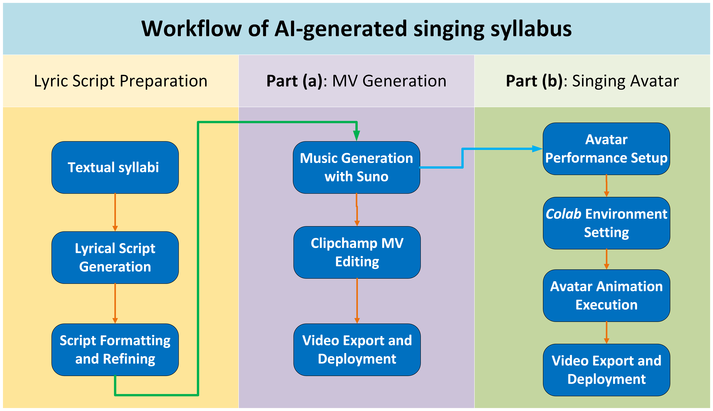

# Singing Syllabi with Virtual Avatars: Enhancing Student Engagement Through AI-Generated Music and Digital Embodiment

In practical teaching, we observe that few students thoroughly read or fully comprehend the information provided in traditional, text-based course syllabi. As a result, essential details, such as course policies and learning outcomes, are frequently overlooked. To address this challenge, in this paper, we proposed a novel approach leveraging AI-generated singing and virtual avatars to present syllabi in a format that is more visually appealing, engaging, and memorable. Especially, we leveraged the open-source tool, HeyGem, to transform textual syllabi into audiovisual presentations, in which digital avatars perform the syllabus content as songs. The proposed approach aims to stimulate students’ curiosity, foster emotional connection, and enhance retention of critical course information. Student feedback indicated that AI-sung syllabi significantly improved awareness and recall of key course information. 

Paper link [https://arxiv.org/abs/2508.11872](https://arxiv.org/abs/2508.11872)

---
To bring the AI-sung syllabus concept to life, we developed a multi-stage pipeline integrating lyric generation, audio synthesis, avatar performance, and final video production. 





---

## The implementation of Part (a)
***Step 1***: Lyrical Script Generation. The original syllabus content is converted into an initial lyrical script using the AI language model ChatGPT (https://chatgpt.com/). 

***Step 2***: Script Formatting and Refinement. The initial AI-generated lyrical script is saved in plain text format with clear section markers. These initial outputs are manually refined to enhance informational clarity, accuracy, musical coherence, and rhythm, ensuring optimal alignment with subsequent audio and visual components.

***Step 3***: Music Generation with Suno AI (https://suno.com/). Using the AI-powered music synthesis platform Suno, the finalized lyrical script is converted into professionally produced sung audio.

***Step 4***: MV generation. Using Microsoft Clipchamp (https://clipchamp.com/) to produce a basic music video (MV)

***Step 5***: Video Export and Deployment. The final animated video performance, typically exported in MP4 format (see MV below), is then ready for integration and deployment on various course platforms, such as Canvas or other LMSs.

https://github.com/user-attachments/assets/1a18c738-5fee-430d-8e68-0087135ba717

---
## The implementation of Part (b)

> To facilitate the virtual avatar performance, we customized a streamlined implementation of HeyGem specifically tailored for our educational context. This implementation provides a user-friendly workflow that effortlessly generates lifelike avatar performance videos from either textual or audio inputs. Users can simply upload a pre-generated audio file (in MP3 or WAV format) along with a reference video to produce visually compelling performances featuring photorealistic digital avatar singers. Our workflow ensures seamless synchronization between audio and expressive facial animations, including precise lip-sync and emotional delivery, enhancing the visual appeal and resonance of the syllabus content.

***Step 1***: Lyrical Script Generation. The original syllabus content is converted into an initial lyrical script using the AI language model ChatGPT (https://chatgpt.com/). 

***Step 2***: Script Formatting and Refinement. The initial AI-generated lyrical script is saved in plain text format with clear section markers. These initial outputs are manually refined to enhance informational clarity, accuracy, musical coherence, and rhythm, ensuring optimal alignment with subsequent audio and visual components.

***Step 3***: Music Generation with Suno AI (https://suno.com/). Using the AI-powered music synthesis platform Suno, the finalized lyrical script is converted into professionally produced sung audio.

***Step 4***: Avatar Performance Setup. The generated audio file (e.g., audio.wav) and an avatar video template are uploaded to the designated project folder on Google Drive.

***Step 5***: Colab Environment Setting.  Within the HeyGem project Google Colab notebook (https://github.com/xinxingwu-uk/Colab_Implementation-HeyGem/blob/main/Audio2Video.ipynb), we mount Google Drive, set the runtime environment to Python 3 with an A100 GPU hardware accelerator, and install all necessary dependencies.

***Step 6***: Avatar Animation Generation. The system generates a photorealistic animated avatar performance featuring synchronized facial expressions, accurate lip movements, and appropriate emotional cues aligned precisely with the provided audio.

***Step 7***: Video Export and Deployment. The final animated video performance, typically exported in MP4 format (see MV below), is then ready for integration and deployment on various course platforms, such as Canvas or other LMSs.

---
The following runtime and execution details correspond to Steps 4–7 of the workflow - <b>The implementation of Part (b)</b> above. 

> To maximize accessibility and reproducibility, we developed a streamlined implementation of HeyGem utilizing cloud-based resources via Google Colab, thus eliminating the need for local GPU installation or complex setup procedures. Specifically, the implementation was deployed using Python 3.8 with an A100 GPU hardware accelerator. 

> The core script (run.py) was executed by specifying paths to the input audio and avatar video files using the following command:

```!python3.8 run.py --audio_path example/song.mp3 --video_path example/videoSing.mp4```

> Upon completion, the final avatar singing video was automatically saved in the designated folder in Google Drive.


***Note 1***: For greater accessibility, we provided a user-friendly Google Colab project, featuring a Python-based implementation of HeyGem. The developed approach allowed users to input text or audio along with a reference video and then generate lifelike singing performances using digital human models powered by deep learning techniques. 

***Note 2***: Regarding the implementation of virtual avatar performance, for more details, see https://github.com/xinxingwu-uk/Colab_Implementation-HeyGem/tree/main

---

### Example Workflow for Generating a Video from Audio and a Reference Video

- Audio + Reference Video → Generated Video ([Audio2Video.ipynb](https://github.com/xinxingwu-uk/Colab_Implementation-HeyGem/blob/main/Audio2Video.ipynb))

<table class="center">
<tr>
    <td width=30% style="border: none">
        Input - Audio
    </td>
    <td width=35% style="border: none">
        Input - Reference Video
    </td>
    <td width=35% style="border: none">
        Output - Generated Video
    </td>
</tr>

<tr>
    <td width=30% style="border: none">
       <a href="https://github.com/xinxingwu-uk/Colab_Implementation-HeyGem/blob/main/resources/audio2videoAudio.mp3">Audio</a>
    </td>
    <td width=35% style="border: none">
        <video controls loop src="https://github.com/user-attachments/assets/dc00158b-940c-4bc9-9556-7599c086b626" muted="false"></video>
    </td>
    <td width=35% style="border: none">
        <video controls loop src="https://github.com/user-attachments/assets/a43c099c-c013-4cde-9d01-131ef0398590" muted="false"></video>
    </td>
</tr>
</table>

---

###  Generated Video examples from Audio and a Reference Video
<table class="center">
<tr>
    <td height=300px style="border: none">
        <video controls loop src="https://github.com/user-attachments/assets/ba5b530c-6e80-4e07-a9fa-3aba12209205" muted="false"></video>
    </td>
    <td height=300px style="border: none">
        <video controls loop src="https://github.com/user-attachments/assets/9f2e267b-bdcd-47c1-a181-fc1b5afc9266" muted="false"></video>
    </td>
</tr>
</table>

***Note***: We have observed that the model performs suboptimally when tested on animation videos. This is likely because the underlying model was primarily trained on real, human-centric datasets. As a result, its ability to generalize to animation videos is limited, and the outputs in these cases may be less accurate or realistic.

<hr>

More demos can be found here

<a href="https://github.com/xinxingwu-uk/SSVA/blob/main/materials/CSE410Low.mp4">Demo 1</a>

<a href="https://github.com/xinxingwu-uk/SSVA/blob/main/materials/MIS632Low.mp4">Demo 2</a>

<a href="https://github.com/xinxingwu-uk/SSVA/blob/main/materials/CSE300Low.mp4">Demo 3</a>


<hr>

## Extension 1 (January 2026)  

<a href="https://xinxingwu-ksu.github.io/projects/4_PlayerInAir/">Demo</a>


---

## Extension 2 (March 2026)  

<a href="https://xinxingwu-ksu.github.io/projects/WebInAirExtened/">Demo</a>


---

## License

This repository is licensed under the terms specified in the [**LICENSE**](https://github.com/xinxingwu-uk/SSVA/blob/main/LICENSE) file.

Please review the LICENSE before using, modifying, or redistributing any part of this project.
